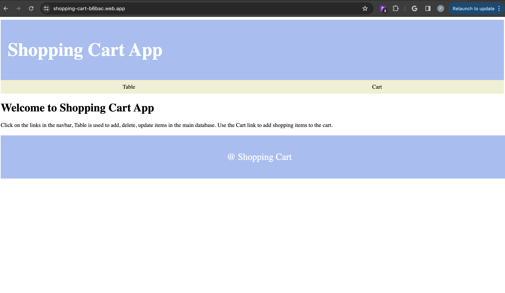
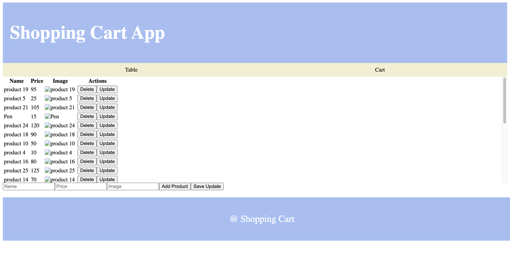
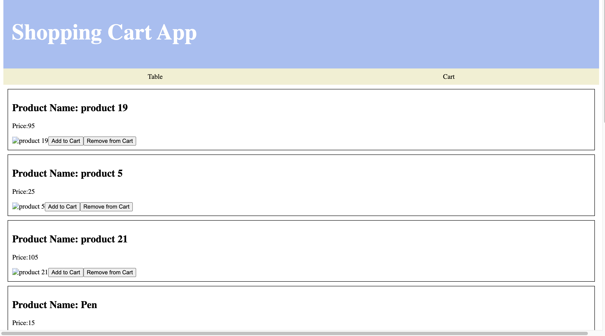
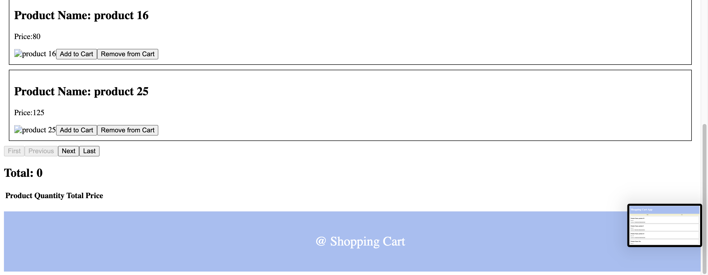
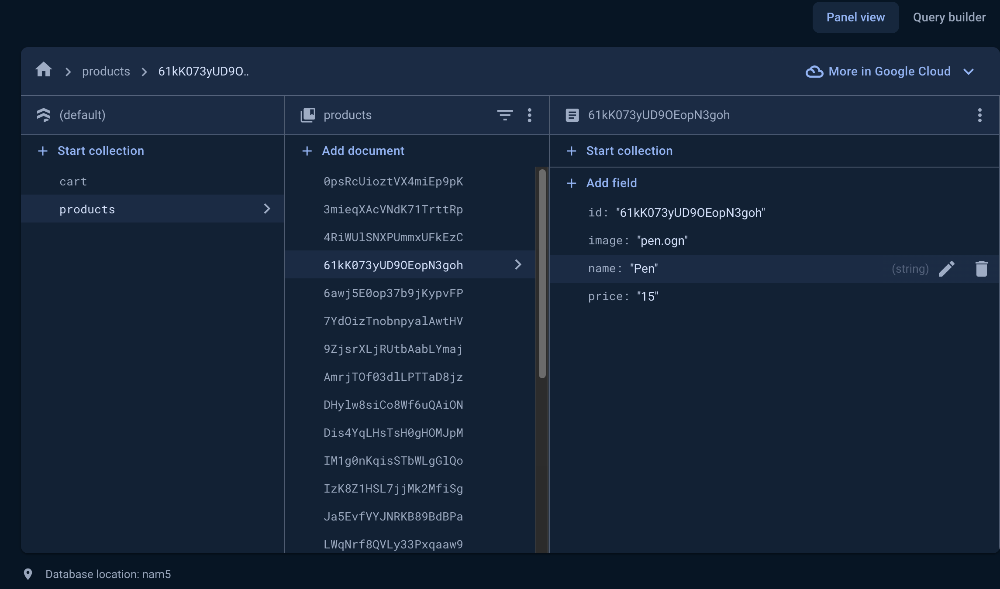

# Shopping Cart
This is a simple shopping cart application, that allows users to add/remove products to the cart, create, update, delete products from the total list of available products.
The application makes use of Firestore database to store a list of collections which are:

- Products (Database Collection)
 The list of available products with the attributes (ID, Name, Price, Image).
Functionalities:
- Users can create a new product with the attributes (Name, Price, Image)
- Users can update an existing product whose attributes are (Name, Price & Image)
- Users can also delete a product from the database

All these functionalities are implemented using Firestore Database in live-time. The elements are stored in a collection called "products" which are then rendered in the Table Component which can be accessed via the NavBar.
The user operations are all reflected in the database.

- Cart (Database Collection)
This is for storing the items in the cart and has the following attributes (Name, Price, Qty, Total Price)
Functionalities:
- The users can add a particular product to the cart
- The users can increment/decrement the qty of the products
- Pagination has been implemented to render 10 products per page, (The Database has 25 items to which the user can add more if need be). The choice for 10 per page was done to show the working of the pagination, since we have four buttons (First Page, Next Page, Previous Page, Last Page).
- The total price of the items are calculated & displayed, followed by a table which has the list of items added to the cart along with their price & qty.


These functionalities are also implemented using the Firestore Database and are dynamically changed. If the qty of the products or if the products are removed from the cart. The changes are reflected in the database collection "cart".

These are the following tools used for this project:

- Framework - React-Vite
- CSS - Custom sytling
- Backend - Firestore Database
- Hosting - Firebase Hosting

The app uses Functional programming & hooks such as useState & useEffect to capture the current state and changes made, which are then implemented in the Database.


## Getting Started

To get a local copy up and running, follow these simple steps.

1. Make sure you have the latest version of NodeJS installed using the command:

```bash
npm install npm@latest -g
```
2. Clone the repository using the following command:
```bash
git clone https://github.com/Pranav2501/NexusNet.git
```
3. Move to the project folder using:
```bash
cd NexusNet
```

3. To install package dependencies, use the following command:
```bash
npm install
```
4. To run the program:
```bash
npm run dev
```

5. If any errors, persist make sure you have Firebase installed:
```bash
npm install --save firebase
```
### Hosting
The project is currently hosted using Firebase, kindly use this link: https://shopping-cart-b6bac.web.app

### Video Demo
Link to video - https://northeastern.zoom.us/rec/share/3iniR7-2MyC5IzcYPbpJBk0A9xqLAH218qfkvCh8Ex9_jwfztw4uXvhDb7IFaSww.ecP_YDfAedLuasFR?startTime=1709538654000
Passcode: 1Fm%Y^KU
### LICENSE

The project is licensed user MIT and is publicly available to all for use.

### Acknowledgments 
- CS 5010 Programming Design Paradigms Course by Dr. John Alexis Guerra Gomez (Professor) & Mr. Ali Saremi (TA)

### Snapshots
Home Page

List of Products with CRUD Operations

Adding products to Cart (Add, Remove from Cart)

Product Page with Pagination (10 per page)

Firestore Database with Collections


